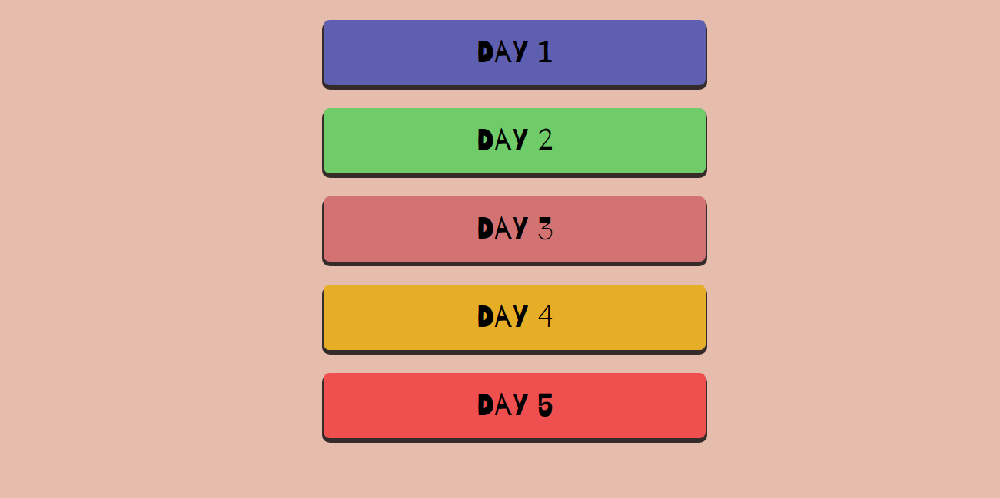

# :cookie: Html5Advanced 
> Modules integration in HTML5

## Menu of files 

[Enter and see the enjoy the menu page!!](EricRSuarez.github.io/Html5)

## Description       

 I realized a course when I learned to integrate css and js awesome modules to my project, The Teacher was Manz. :) 
 
---
**Spanish Version**

 Curso desarrollado por la Manz, para la impartición de conocimientos y liberías avanzadas para el desarrollo en **HTML5**. El curso ha
 sido realizado en **20horas** comprendida en 4 horas cada día durante la semana del 13/03/2017-17/03/2017.
  
  
## Asistencia

- [x] Lunes
- [x] Martes
- [x] Miércoles
- [x] Jueves
- [x] Viernes

***
***
                                                  Eric Ramos Suárez
***
***

